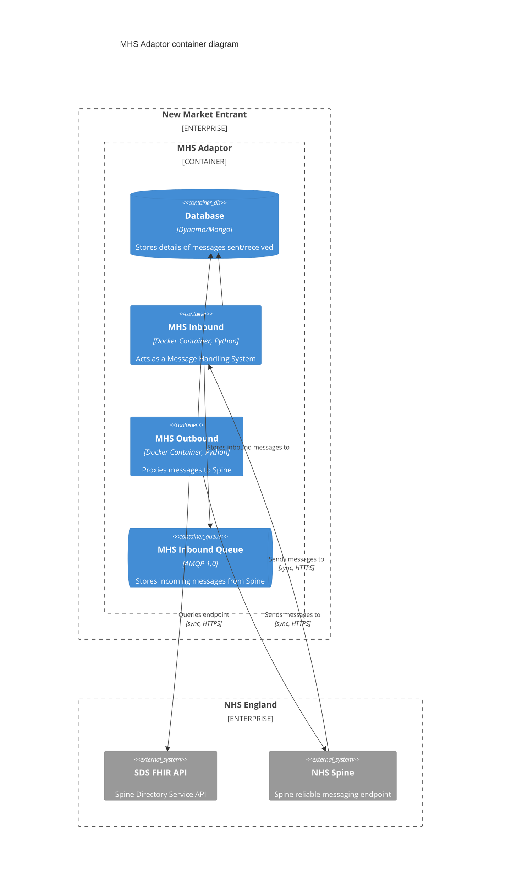
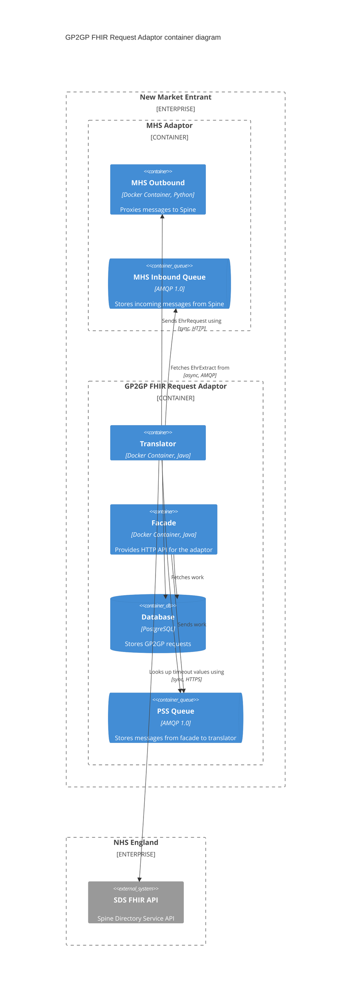
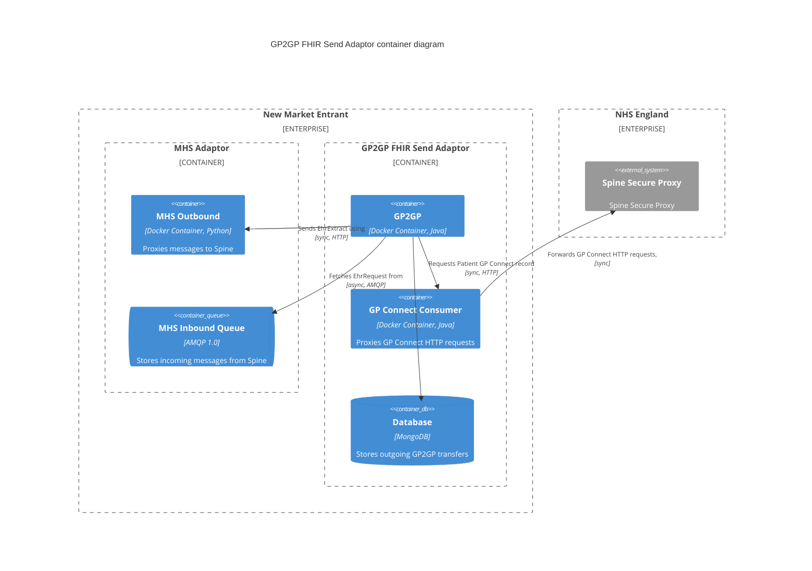

# Setting up the GP2GP Adaptors within INT

The below instructions assume you will be using a single message broker for all messages.

### Setting up the MHS adaptor



This is a __required__ prerequisite for both requesting and sending adaptors. 

1. Identify a HSCN IP address(es) which can be used for the GP2GP process, and made available to the machine running the MHS Inbound.
   This IP will be used by Spine when initiating HTTPS requests into your environment.
1. Request a new FQDN `<gp2gpname>.<suppliername>.thirdparty.nhs.uk` from NHS England DNS team and request it resolve to the HSCN IP
   identified above. Include some indicator in the gp2gp name that this is a test/INT hostname, to differentiate it from the live hostname.
   Example FQDN: `test-gp2gp.adrian.thirdparty.nhs.uk`.
1. Create an Certificate Signing Request for the newly created FQDN, submit to the NHS ITOC requesting an endpoint for this.
   During the creation of the CSR you'll be given a private key, copy this into the `MHS_SECRET_CLIENT_KEY` environment variable for Inbound/Outbound adaptors.
1. ITOC will provide a certificate once this has been done, copy this into the `MHS_SECRET_CLIENT_CERT` environment variable for Inbound/Outbound adaptors.
1. Request from ITOC that new GP2GP product be registered in SDS to your test GP Surgery using the same endpoint FQDN you used above.
1. ITOC will provide a Party Key once this has been done, copy this into the `MHS_SECRET_PARTY_KEY` environment variable for Inbound/Outbound adaptors.
1. Populate the `MHS_SECRET_CA_CERTS` environment variable for Inbound/Outbound adaptors using both [Root and Sub CA certificates for INT][spine-certificates].
   When a certificate rotation is announced, you can provide the two older certificates and two newer certificates to tell the adaptor that all are trusted.
   The ordering of certificates within this environment variable is unimportant.
   Each certificate should be concatenated back to back within the environment variable, looking like the following:
   ```
   -----BEGIN CERTIFICATE-----
   MIIFtDC...
   -----END CERTIFICATE-----
   -----BEGIN CERTIFICATE-----
   MIIFhzCC...
   -----END CERTIFICATE-----
   ```
1. Specify the `MHS_FORWARD_RELIABLE_ENDPOINT_URL` environment variable for Inbound/Outbound adaptors set to the value
   specified by the [Integration Environment - Messaging URLs][messaging-urls] "Used for all domain reliable messaging".
   When specifying the URL you will need to provide the hostname provided by the Spine team.
   This hostname will not be resolvable via public DNS however, so you will either need to either add the IP address
   specified for the host into your `/etc/hosts` file or use the [HSCN DNS servers] for DNS resolution.

[HSCN DNS servers]: https://digital.nhs.uk/services/health-and-social-care-network/hscn-technical-guidance/dns
[messaging-urls]: https://digital.nhs.uk/services/path-to-live-environments/integration-environment#messaging-urls
[spine-certificates]: https://digital.nhs.uk/services/path-to-live-environments/integration-environment#rootca-and-subca-certificates

### Requesting adaptor




1. Spin up a Postgres database, and run the [application schema migration script,
   followed by with the SNOMED import script](OPERATING.md#database-requirements).
1. Spin up the PS Adaptor facade and translator, specifying `PS_DB_URL` to point at the database,
   and the broker related environment variables.
1. For the translator container, specify the `MHS_BASE_URL` variable pointing to the MHS Outbound adaptor created above,
   and `PS_DAISY_CHAINING_ACTIVE` to "true".
1. Configure the [attachment storage options](OPERATING.md#attachment-storage) for the requesting adaptor.
1. Configure the migration timeout options, specifying both the `SDS_BASE_URL` and `SDS_API_KEY`.
1. Make a HTTP request to the facade container, using a test NHS Number.
   Contact the NIA Support team (niasupport@nhs.net) for more details on this.
1. Look at the MHS Outbound logs, to see if the outbound request is sent successfully.
   You should see a 200 response and no ERROR messages.
1. Look at the MHS Inbound logs to see if you see the losing GP practice sends over the medical record.
   You should see some activity in the logs, along with a 200 response and no ERROR messages.
1. Query the PS Adaptor again to see if your patient has been returned.

### Sending adaptor



1. Before testing a sending scenario you will need a working [GP Connect Access Record] implementation.
1. Spin up the GP Connect Consumer adaptor.
   You can use the same private key and certificate created for your GP Connect producer, for the consumer adaptor.
   These values need to be specified in the environment variables `GPC_CONSUMER_SPINE_CLIENT_KEY` and `GPC_CONSUMER_SPINE_CLIENT_CERT` respectively.
1. Spin up a Mongo database, this is what the GP2GP adaptor uses to store transfer information.
1. Spin up the GP2GP Adaptor and configure the `GP2GP_GPC_GET_URL` variable to point to the GP Connect Consumer adaptor
   above.
   Specify the `GP2GP_MHS_OUTBOUND_URL` to point at the MHS Outbound created above,
   `GP2GP_MHS_INBOUND_QUEUE` to the value "gp2gpInboundQueue", and the [Mongo DB variables][database_configuration_options] as required.
1. Contact the NIA Support team (niasupport@nhs.net) with details of a test patient registered to your GP Surgery,
   who will then test that your adaptor is set up correctly and able to send the patients medical record over spine.

[database_configuration_options]: https://github.com/NHSDigital/integration-adaptor-gp2gp-sending/blob/main/OPERATING.md#database-configuration-options
[GP Connect Access Record]: https://digital.nhs.uk/services/gp-connect/gp-connect-in-your-organisation/gp-connect-access-record
