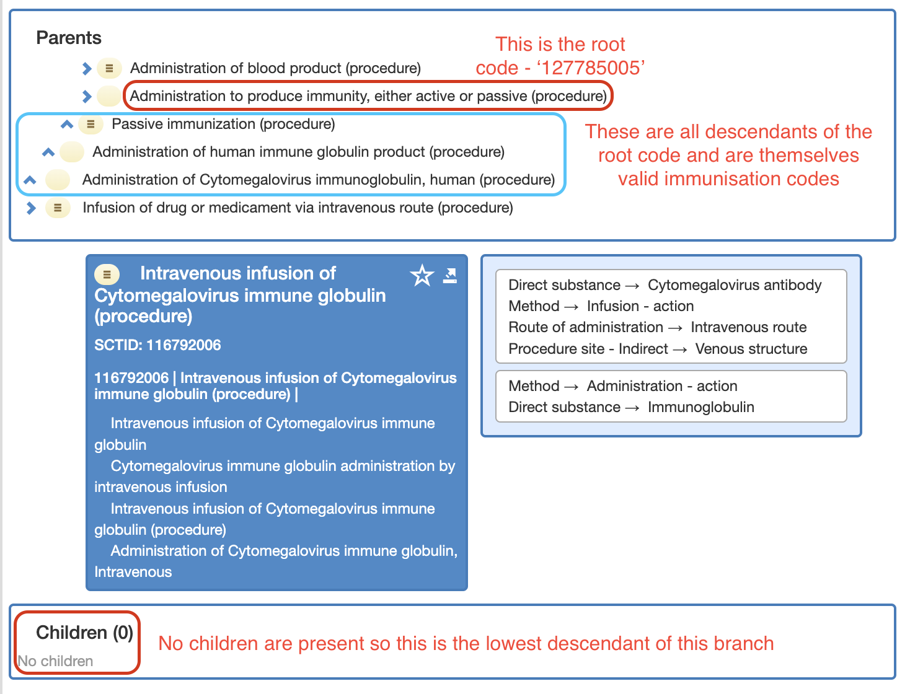

# SNOMED CT DATABASE

PostgreSQL SQL Scripts to create and populate a PostgreSQL database with a SNOMED CT terminology release, along with
creating a materialised view of known immunization codes.

**NOTE:** This script is based on [IHTSDO/snomed-database-loader](https://github.com/IHTSDO/snomed-database-loader/tree/master/PostgreSQL).

Script does not load full SNOMED DB - only the subset required by PS Adaptor.

## Immunization Codes

In order to identify whether an observation is considered to be an immunization / vaccination, the adaptor checks the
provided SNOMED code against a materialised view of SNOMED CT conceptIds created by this script. 
These immunization codes are constructed from using the following methods:

### Immunization root codes

The SNOMED CT schema is build in a hierarchical structure with a relationship reference set which defines whether a 
particular is a child of another code (identified using the type code of `116680003` (`IsA`)).  These root codes refer
to a certain set of codes under which most other immunization codes exists.

These root codes are as follows:

| SNOMED Code    | Description                                                               |
|----------------|---------------------------------------------------------------------------|
| 787859002      | Vaccine Product (medicinal product)                                       |
| 127785005      | Administration to produce immunity, either active or passive (procedure)  |
| 304250009      | Immunization status (finding)                                             |
| 90351000119108 | Vaccination not done (situation)                                          |
| 713404003      | Vaccination given (situation)                                             |

### Immunization root code descendants

For each of the root codes, the script recursively searches through the hierarchy until the lowest child of each is 
reached, adding each SNOMED code as it encounters them.

This hierarchy can be illustrated using the [SNOMED CT Browser](https://termbrowser.nhs.uk/):

### Immunizations outside of root code hierarchy

There also exist a number of codes which do not sit within the hierarchy of the root codes listed above. These are
usually codes for which an immunization is not provided anymore but may be present on the history of a patients.
An example of one of these codes in the [SNOMED CT Browser](https://termbrowser.nhs.uk/) is below:

However, the reference set used to build the immunization codes still includes inactive relationships so these will
we included when building the descendants of immunization root codes.

## Minimum Specification

- PostgreSQL v.9

## How to run (Mac & Unix)

### Prerequsistes
1. Download SNOMED CT Release 
2. Set the following env vars:
- PS_DB_OWNER_NAME (database user, needs permissions to create/drop schemas), e.g. `export PS_DB_OWNER_NAME='postgres'`
- POSTGRES_PASSWORD (database user password), e.g. `export POSTGRES_PASSWORD='********'`
- PS_DB_HOST (database host), e.g. `export PS_DB_HOST='localhost'`
- PS_DB_PORT (database port), e.g. `export PS_DB_PORT='5432'`

### Run the script
e.g. `load_release-postgresql.sh <path-to-downloaded-snomed-ct-release>`
